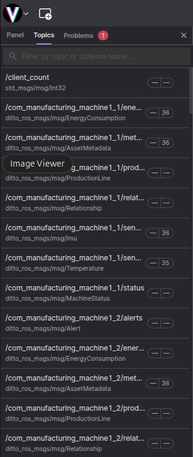
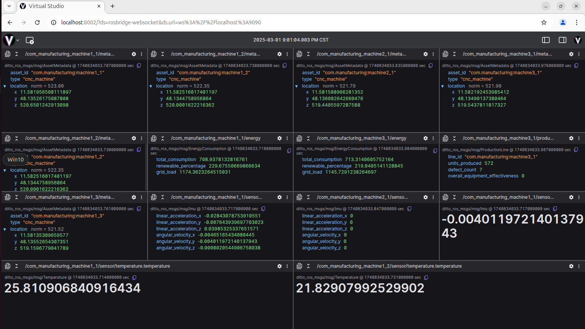

# Unified Dashboard in Virtual Studio for IoT Data Monitoring

## Overview

This guide provides a step-by-step process to create a unified dashboard in Virtual Studio for monitoring data from various sources, including IoT devices and production machines. The setup leverages Eclipse Ditto for digital twin management, ROS 2 for robotic data integration, and The Things Network (TTN) for IoT device connectivity.

## Core Infrastructure Setup

This setup is divided into two phases:

### Phase 1: Setting up Eclipse Ditto

This phase focuses on installing and configuring Eclipse Ditto, which will serve as the foundation for managing digital twins of your assets.

**Install and Configure Eclipse Ditto:** ([Source: Eclipse Ditto README](https://github.com/eclipse-ditto/ditto))

**Step 1.1: Clone Eclipse Ditto**

Clone the Eclipse Ditto repository to your server or cloud environment. Open a new terminal and execute the following command:

```bash
git clone https://github.com/eclipse-ditto/ditto.git
```

**Step 1.2: Configure and Deploy Ditto with Docker Compose**

Navigate to the Docker deployment directory and use Docker Compose to start Ditto.

```bash
cd ditto/deployment/docker/
docker-compose up -d
```

**Step 1.3: Verify Ditto is Running**

Check the logs to ensure Ditto services are running correctly.

```bash
docker-compose logs -f
```

Upon successful setup, you will have the following components running:

  * **MongoDB:**  Backing datastore for Eclipse Ditto (deployed via Docker).
  * **Ditto Microservices:**
      * Policies
      * Things
      * Things-Search
      * Gateway
      * Connectivity

### Phase 2: Connecting to ROS 2 and Visualizing Data in Virtual Studio

This phase involves setting up ROS 2, bridging it with Eclipse Ditto, and configuring Virtual Studio for data visualization.

**Install and Configure ROS 2:**

**Step 3.1: Install ROS 2**

Install ROS 2 on your system. This guide uses ROS 2 Jazzy running on Ubuntu 24 Noble. Refer to the [official ROS 2 documentation](https://www.google.com/url?sa=E&source=gmail&q=https://docs.ros.org/en/jazzy/Installation/Ubuntu-Install-Debians.html) for detailed installation instructions.

**Step 3.2: Source ROS 2 Environment**

Add the ROS 2 sourcing command to your shell startup script to automatically set up the ROS 2 environment in new terminals.

```bash
echo "source /opt/ros/jazzy/setup.bash" >> ~/.bashrc
```

**Install and Configure `ditto_ros_bridge`:** ([Source: ditto\_ros\_bridge README](https://github.com/virtualaichina/ditto_ros_bridge))

**Step 4.1: Clone and Build `ditto_ros_bridge`**

Clone the `ditto_ros_bridge` package, build it using `colcon`, and source the setup file.

```bash
git clone https://github.com/virtualaichina/ditto_ros_bridge
cd ditto_ros_bridge
colcon build
source install/setup.bash
sudo apt install python3-aiohttp
ros2 launch ditto_ros_bridge bridge.launch.py
```

Now, the `ditto-ros-bridge` is running and facilitating communication between ROS 2 and Eclipse Ditto.

**Install and Configure `ros_bridge`:**

**Step 5.1: Install `ros_bridge`**

Install the `ros_bridge` package to connect ROS 2 to Virtual Studio.

```bash
sudo apt install ros-jazzy-rosbridge-server
```

**Step 5.2: Launch `ros_bridge` WebSocket Server**

Run the `ros_bridge` WebSocket server. Ensure you are in the `ditto_ros_bridge` directory and have sourced `install/setup.bash` to ensure proper message type recognition. Open a new terminal and execute:

```bash
cd ditto_ros_bridge/
source install/setup.bash
ros2 launch rosbridge_server rosbridge_websocket_launch.xml
```

The Rosbridge WebSocket server is now started and listening on port `9090`.

**Set Up Virtual Studio:**

**Step 6.1: Install and Launch Virtual Studio**

Install and run Virtual Studio using Docker.

```bash
sudo docker pull docker.io/virtualaichina/virtual-studio:v1.0
sudo docker run -p "8002:8002" virtualaichina/virtual-studio:v1.0
```

Open your web browser and navigate to `http://localhost:8002`. Welcome to Virtual Studio\!

**Step 6.2: Connect Virtual Studio to `ros_bridge`**

Connect Virtual Studio to the `ros_bridge` WebSocket server. In Virtual Studio, click on the menu (Virtual Studio icon) -\> **Open connection**. In the popup dialog, choose **Rosbridge** and enter the following URL:

```
ws://localhost:9090
```

## Industrial Manufacturing Simulation and Testing

**Simulate Industrial Manufacturing Data:**

Use the `smart_manufacturing_sim.py` script to simulate industrial manufacturing data and publish it to ROS 2 topics.

Open a new terminal, navigate to the `ditto_ros_bridge` directory, and run the script:

```bash
cd ditto_ros_bridge/
python3 smart_manufacturing_sim.py
```

**Verify ROS 2 Topics in Virtual Studio:**

If the setup is successful, you should see the industrial manufacturing ROS 2 topics in Virtual Studio. Click on "Topics" in the left panel of Virtual Studio.




**Visualize Data with Virtual Studio Panels:**

You can now add various panels in Virtual Studio, such as raw message panels, to monitor the ROS 2 topics. The `smart_manufacturing_sim.py` script periodically updates industrial data in Eclipse Ditto, which is then reflected in your Virtual Studio dashboard.




Congratulations\! You have successfully set up a unified dashboard in Virtual Studio to monitor data from various sources using Eclipse Ditto, ROS 2, and related bridges. You can now customize your dashboard further by adding more panels and connecting additional data sources.
